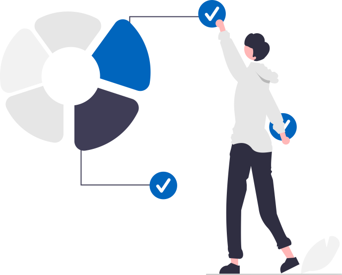

<p align="center"> 
    </img>
</p>

<h1 align="center"><br><b><a target="_blank" href="#">< S0ftPortfolio /></a></b></br> 
<h3 align="center">・O modelo completo de portfólio para profissionais de T.I totalmente personalizável. Este modelo permite que você exiba seus projetos e forneça informações detalhadas sobre suas habilidades e experiências.</h3>

<p align="center">


    


</p>

<h3 align="center"> ⭐ Avalie o Projeto! (+) </h3>

# 📚 Sessões

- Sobre Mim
- Código Aberto (Github)
- Experiência
- Blogs
- Educação
- Contatos

- **[Exemplo Online](https://gabr1elazevedo.github.io/)**

# 📋 Clonagem

### Pré-requisitos de desenvolvimento.
  
Este projeto utiliza a biblioteca `React.JS` do `JavaScript`. Para desenvolvê-lo, é necessário ter o `Node.JS` e o `NPM` instalados em sua máquina.

### Instalação das dependências.

Acesse o site oficial do `Node.JS` [Download](https://nodejs.org/en) e baixe a versão mais recente estável ou uma versão compatível com os badges indicados no repositório.
Durante a instalação do `Node.JS`, o `NPM` (Node Package Manager) será automaticamente instalado.

### Configurando o ambiente de desenvolvimento.

- Clone do repositório:

Após a instalação bem-sucedida do `Node.JS` e `NPM`, abra o terminal e execute o seguinte comando para clonar o repositório para o seu sistema local:

```Bash
git clone https://github.com/gabr1elazevedo/S0ftPortfolio.git
```
*(Este comando irá baixar todos os arquivos do projeto para a sua máquina.)*

- Instalação de dependências:

Navegue até o diretório onde o repositório clonado foi armazenado e execute o seguinte comando para instalar as dependências necessárias:

```Bash
npm install
```
*(Este comando irá baixar e instalar todas as bibliotecas externas utilizadas pelo projeto.)*

- Executando o projeto:

Com as dependências instaladas, você já pode iniciar o projeto localmente. Execute o seguinte comando no terminal:

```Bash
npm start
```
*(Este comando irá iniciar o servidor de desenvolvimento e abrir o website em seu navegador.)*

# ✏️ Customização

### Personalizando seu Portfólio Online!

Este guia permite que você personalize seu portfólio online, tornando-o uma representação única e impactante de suas habilidades e experiências. Aqui estão as principais áreas que você pode modificar:

- Arquivo package.json

1. Localize este arquivo no diretório principal do seu projeto.

2. Altere a propriedade `"name"` para refletir o identificador preferido do seu site.

3. Atualize a propriedade `"homepage"` para `https://<seu-username-github>.github.io`.
*Certifique-se de incluir `https://` para garantir o carregamento correto das fontes*.

- Informações Pessoais

1. Abra o diretório `src/portfolio.js`. Este arquivo contém dados sobre você.

2. Modifique as seguintes seções dentro de `portfolio.js` para adaptá-las ao seu histórico:

3. Página Inicial:
Seção `greeting` para sua introdução e mensagem de boas-vindas.

4. Mídias Sociais:
`socialMediaLinks` para seus perfis de mídia social *links e ícones*.

6. Detalhes Profissionais:
`Experiência, Educação, Habilidades, Certificações` *logos, ícones, etc...*

7. Blog:
Inclua os detalhes do seu blog, se aplicável *link, descrição*.

8. Informações de Contato:
Adicione seus dados de contato: *e-mail, telefone etc...*

### Ícones na Página Inicial.

Fonte de Dados:
A seção de habilidades obtém dados do array `skills` dentro de `portfolio.js`.

- Adicionando Ícones

1. Visite [Iconify](https://icon-sets.iconify.design/) e procure o ícone de habilidade desejada.
Selecione o ícone de sua preferência.
Copie o texto exibido ao lado de "Ícone Selecionado".

2. Em `portfolio.js`, localize o objeto `softwareSkill` correspondente para aquela habilidade.

3. Substitua a propriedade `fontAwesomeClassName` desse objeto `softwareSkill` pelo texto copiado.

### Imagens Personalizadas.

1. Coloque o arquivo de imagem no diretório `public/skills`.
Dentro de `portfolio.js`, para o objeto `softwareSkill` relevante.

2. Defina a propriedade `imageSrc` como o nome do arquivo da imagem.

3. Remova ou deixe vazia a propriedade `fontAwesomeClassName`, ela tem prioridade sobre `imageSrc`.
Para estilizar a imagem, use a propriedade `style` dentro de `softwareSkill`.

### Informações do GitHub.

1. Busca de Dados:
`fetcher.mjs` no diretório principal, recupera dados do GitHub *pull requests, issues etc...*

3. Variáveis de Ambiente:
Crie um novo arquivo chamado `.env` no diretório principal.

4. Copie o conteúdo de `env.example` para `.env`.

5. Dentro de `.env`, atualize:
`GITHUB_TOKEN`: Obtenha um token de acesso pessoal do [GitHub Token](https://github.com/settings/tokens) concedendo todas as permissões. `GITHUB_USERNAME`: Defina como seu nome de usuário do GitHub.

6. Executando o Script de Atualização:
Certifique-se de ter executado o comando `npm install` previamente.

7. Execute o seguinte comando: `node fetcher.mjs` **(Aviso: Nunca compartilhe seus tokens do GitHub; use-os como variáveis de ambiente.)**

### Logo de Abertura

O logotipo animado apresentado no site de exemplo utiliza o `Figma` para `(Design)` e `(CSS3)` para animação. *Esta parte específica não é personalizável*.

- Alternativas:

1. Crie Seu Próprio Logo:
Use [Figma](https://www.figma.com/), [Adobe XD](https://www.adobe.com/br/), [Adobe Illustrator](https://www.adobe.com/br/) ou [Inkscape](https://inkscape.org/pt-br/), para criar o seu próprio logotipo.

3. Para animação, consulte o diretório: `./src/components/Loader`, para exemplos: `chosenTheme`

4. Desativar a Tela de Abertura:
Abra `src/portfolio.js`.
Localize o objeto `settings`.


# 🎨 Temas

### Alterar os temas do Portfólio.

Você pode dar uma olhada no arquivo `src/theme.js` onde todos os temas disponíveis são mencionados com seus respectivos códigos de cores.
Logo abaixo, você verá o código do arquivo:

```JavaScript
export const chosenTheme = blueTheme;
```
*(Você precisa alterar o nome de `blackTheme` para o tema que deseja definir para o seu site.)*

Você pode definir novos temas de maneira semelhante a outros temas e pode atribuir o nome desse novo tema definido a `chosenTheme`.
É isso. Você só precisa alterar o nome do tema e o código cuidará de todo o resto.
**Execute `npm start` para verificar se está tudo certo!**

# 📦 Hospedagem

### Deixando seu Portfólio online!

Agora que você concluiu todas as etapas anteriores com sucesso, é hora de colocar seu site online!
**Eu altamente recomendo usar o `GitHub Pages` para fazer isso da maneira mais fácil.**

Para implantar seu site, você tem duas opções. Primeiro, você precisa criar um repositório GitHub com o nome `<seu-username-github>.github.io`. **Por favor, não dê nenhum outro nome a ele.**

Agora, você precisa gerar uma compilação de produção e implantar o site.

- Alternativa 1

1. Execute `npm run build` para gerar a pasta de compilação de produção.

2. Entre na pasta de compilação, execute `git init` e envie o código gerado para a `branch master` do seu novo repositório no GitHub. Você pode precisar executar `git init` e forçar o envio a cada nova compilação!

- Alternativa 2

1. Execute `npm run deploy` para compilar e criar uma `branch` chamada `gh-pages`. Ele enviará os arquivos build para essa branch.

2. A última etapa da implantação é habilitar o `GitHub Pages` nas configurações do repositório e selecionar a `branch gh-pages`.
Agora, seu site está implantado com sucesso e você pode visitá-lo em: `<seu-username-github>.github.io`.

# 📄 Licença

- Veja [LICENSE.md](./LICENSE) para mais detalhes.

# ✨ Contribuições

<!-- ALL-CONTRIBUTORS-LIST:START -->
<table>
  <tbody>
    <tr>
      <td align="center" valign="top" width="14.28%"><a href="http://gabr1elazevedo.github.io"><br /><b>Gabriel Azevedo</b></a><br /><a href="https://github.com/gabr1el0x/S0ftPortfolio/commits?author=gabr1elazevedo" title="Code">💻</a> <a href="https://github.com/gabr1el0x/S0ftPortfolio/commits?author=gabr1elazevedo" title="Documentation">📖</a> <a href="#design-gabr1el0x" title="Design">🎨</a> <a href="#maintenance-gabr1elazevedo" title="Maintenance">🚧</a> <a href="#ideas-gabr1elazevedo" title="Ideas, Planning, & Feedback">🤔</a>
  </td>
    </tr>
  </tbody>
</table>

<!-- ALL-CONTRIBUTORS-LIST:END -->

# 👏🏻 Referências

- Este projeto incorpora conceitos de design e implementação inspirados em portfólios de desenvolvedores renomados:
- [Saad Pasta's](https://github.com/saadpasta/developerFolio) | [Ashutosh1919's](https://github.com/ashutosh1919/masterPortfolio)